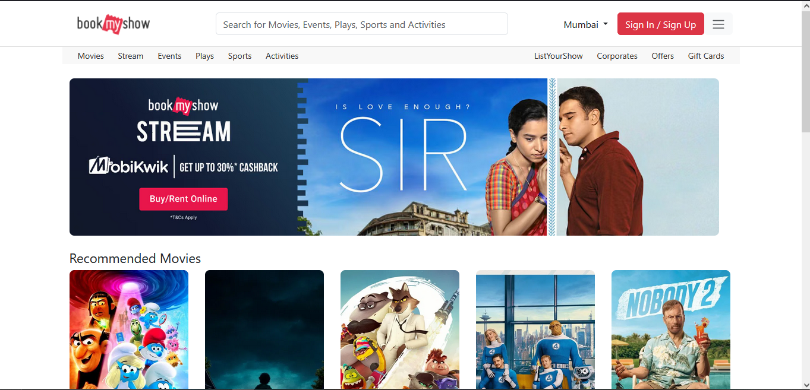

# BookMyShow Clone 🎬

A full-stack Node.js + Express + MongoDB clone of BookMyShow, featuring movie listings, authentication (login/signup), session management, and a modern UI with EJS and Bootstrap.

**Live Demo:**  
[https://bookmyshow-clone-kf31.onrender.com/](https://bookmyshow-clone-kf31.onrender.com/)


---

## Features

- **Now Playing Movies:** Fetches real-time movie data from TMDb API.
- **Movie Details:** Click a movie to view details, cast, and backdrops.
- **Authentication:** Secure login and signup with bcrypt password hashing.
- **Session Management:** User sessions stored in MongoDB using `express-session` and `connect-mongo`.
- **Responsive UI:** Built with Bootstrap 5 and EJS templating.
- **Reusable Components:** Header, footer, and authentication modal as EJS partials.
- **Genre Mapping:** Movie genres are displayed by name, not just ID.
- **Auto-login after Signup:** Users are automatically logged in after successful signup.

---

## Folder Structure

```
bookmyshow-clone
├── config
│   ├── db.js
│   └── keys.js
├── controllers
│   ├── authController.js
│   ├── movieController.js
│   └── userController.js
├── middleware
│   ├── authMiddleware.js
│   └── errorMiddleware.js
├── models
│   ├── Movie.js
│   └── User.js
├── public
│   ├── css
│   ├── js
│   └── images
├── routes
│   ├── authRoutes.js
│   ├── movieRoutes.js
│   └── userRoutes.js
├── views
│   ├── partials
│   ├── auth
│   ├── movies
│   └── users
├── .env
├── .gitignore
├── package.json
└── server.js
```

---

## Installation & Setup

1. Clone the repository:
   ```bash
   git clone https://github.com/yourusername/bookmyshow-clone.git
   cd bookmyshow-clone
   ```
2. Install dependencies:
   ```bash
   npm install
   ```
3. Set up environment variables in a `.env` file:
   ```env
   PORT=5000
   MONGO_URI=your_mongodb_uri
   TMDB_API_KEY=your_tmdb_api_key
   SESSION_SECRET=your_session_secret
   ```
4. Run the application:
   ```bash
   npm start
   ```
5. Access the app at `http://localhost:5000`.

---

## Technologies Used

- **Frontend:** HTML, CSS, JavaScript, Bootstrap 5, EJS
- **Backend:** Node.js, Express
- **Database:** MongoDB
- **Authentication:** bcrypt, express-session, connect-mongo
- **API Integration:** TMDb API

---

## Contributing

1. Fork the repository.
2. Create a new branch: `git checkout -b feature/YourFeature`
3. Make your changes.
4. Commit your changes: `git commit -m 'Add some feature'`
5. Push to the branch: `git push origin feature/YourFeature`
6. Submit a pull request.

---

## License

This project is licensed under the MIT License - see the [LICENSE](LICENSE) file for details.

---

## Acknowledgements

- Inspired by the original BookMyShow platform.
- TMDb API for movie data.
- Bootstrap 5 for responsive design.